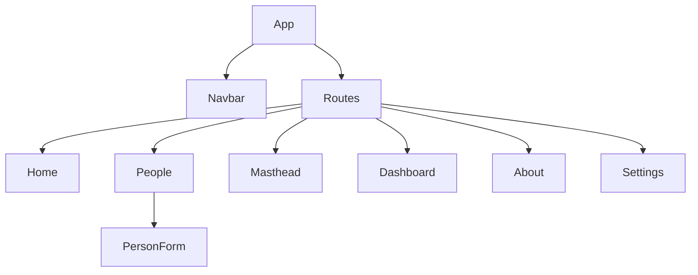

# Frontend Design Document

## Overview
The frontend of the People Management System is a React-based web application that provides a user interface for managing personnel information and viewing organizational structure through a masthead feature.

## Architecture

### Technology Stack
- **Framework**: React.js
- **Routing**: React Router
- **HTTP Client**: Axios
- **Testing**: Jest and React Testing Library

### Component Structure

## Key Components

### People Component
- Manages CRUD operations for personnel
- Displays list of people
- Provides interface for creating, updating, and deleting people records
- Communicates with backend API using direct endpoint approach

### Masthead Component
- Displays personnel organized by roles
- Features card-based sections with responsive layout
- Includes role headings with bottom borders
- Uses subtle shadows and rounded corners for visual depth
- Maintains consistent color scheme with the rest of the application

### Navigation Component
- Provides links to different sections of the application
- Includes links to Home, People, Masthead, Dashboard, About, and Settings

## Routing Structure
- `/`: Home page
- `/people`: People management interface
- `/masthead`: Organizational masthead
- `/dashboard`: Dashboard interface
- `/about`: About page
- `/settings`: Settings page

## API Integration

### Configuration
- Direct endpoint approach using consistent patterns
- All people-related endpoints follow `/people/[action]/[params]` format
- Axios for HTTP requests with proper CORS configuration:
  - Content-Type and Accept headers set to application/json
  - withCredentials: false for cross-origin requests

### Endpoint Usage
- `GET /people`: Retrieve all people
- `POST /people/create`: Create a new person
- `PUT /people/update/{email}`: Update an existing person
- `DELETE /people/{email}`: Delete a person
- Masthead endpoints for retrieving role-based organizational data

## Data Flow

### CRUD Operations
1. User interacts with People component
2. Component makes appropriate API call to backend endpoint
3. Component updates UI based on response from backend

### Masthead Display
1. Masthead component requests data from backend
2. Component renders personnel organized by roles
3. Users can view personnel grouped by their roles

## Testing Strategy
- React Testing Library and Jest for component and integration testing
- Component isolation with mocked dependencies
- Route testing with MemoryRouter
- Comprehensive test coverage for all major components and routes

## Error Handling
- Display appropriate error messages to users
- Handle API errors gracefully
- Provide feedback for form validation errors

## Future Plans
- Enhance UI with additional visualizations
- Enhance user authentication and login interface
- Add advanced filtering and search capabilities
- Improve accessibility features
- Implement responsive design for mobile devices
